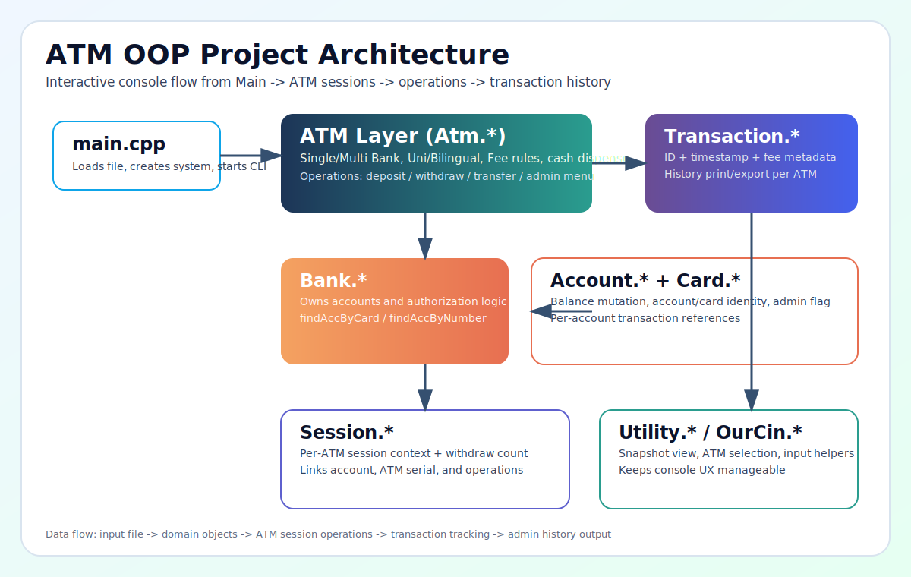

# OOP ATM Machine Project

A C++20 console ATM simulation built for an OOP class group project.

It supports:
- Multiple banks and multiple ATM types
- Single-bank and multi-bank ATM behavior
- Unilingual and bilingual (English/Korean) ATM UI
- Balance inquiry, deposit, withdrawal, transfer
- Admin mode for ATM transaction history
- Receipt generation and history export to files



## Core Features

- `Bank`, `Account`, `Card` domain model
- `Atm` hierarchy:
  - `SingleUnilingual`
  - `SingleBilingual`
  - `MultiUnilingual`
  - `MultiBilingual`
- Session tracking per ATM interaction
- Transaction logging with IDs, timestamps, fees, and session linkage
- Cash inventory management per ATM (50k/10k/5k/1k bills)

## Build

### Option 1: CMake

```bash
cmake -S . -B build
cmake --build build
```

### Option 2: Direct compile (clang++)

```bash
clang++ -std=c++20 -Wall -Wextra -pedantic -o OOP_Project_bin *.cpp
```

## Run

```bash
./build/OOP_Project
```

or

```bash
./OOP_Project_bin
```

The program asks for an input `.txt` file name at startup.

## Input File Format

### 1) Header line

```text
<bankCount> <accountCount> <atmCount>
```

### 2) Bank names (`bankCount` lines)

```text
<bankName>
```

### 3) Accounts (`accountCount` lines)

```text
<bankName> <username> <accountNumber> <balance> <cardNumber> <password>
```

### 4) ATM definitions (`atmCount` lines)

```text
<bankName> <serial6digits> <Single|Multi> <Unilingual|Bilingual> <count50k> <count10k> <count5k> <count1k>
```

Notes:
- `serial6digits` must be exactly 6 numeric characters.
- Names/tokens are read with whitespace separators, so avoid spaces inside one field.

## Example Input

```text
2 3 2
KB
Shinhan
KB Alice 100-111 500000 11112222 1234
Shinhan Bob 200-222 800000 22223333 4321
KB Carol 300-333 1200000 33334444 9999
KB 123456 Single Unilingual 20 40 40 50
Shinhan 654321 Multi Bilingual 30 50 50 70
```

## Runtime Commands

Main command menu:
- `/` show ATM snapshot
- `/UseATM` start an ATM session
- `/Exit` exit program

Inside ATM session:
- `1` balance inquiry
- `2` deposit
- `3` withdrawal
- `4` transfer
- `5` end session
- `6` show snapshot

Admin mode (admin account):
- view ATM-specific transaction history
- export ATM-specific history to file

## Generated Files

- Receipts: `receipt_<username>_<transactionId>.txt`
- Admin export: `atm_<serial>_history_<timestamp>.txt`

## Project Structure

- `main.cpp`: application bootstrap, input loading, command loop
- `Atm.*`: ATM workflow, operations, fees, cash handling
- `Bank.*`, `Account.*`, `Card.*`: banking domain
- `Session.*`: session lifecycle and transaction list per session
- `Transaction.*`: transaction model, history printing/export
- `Utility.*`: CLI helpers for snapshots and ATM selection
- `OurCin.*`: utility input wrapper

## Recent Quality Fixes

- Fixed language-choice input validation for bilingual ATMs
- Fixed transaction history filtering so valid accounts are not skipped
- Simplified duplicate null-check logic in history output
- Adjusted CMake minimum version for broader environment compatibility

## License

No license file is currently defined in this repository.
